# Hello, I'm Aman Srivastava 👋

🧠 Machine Learning | 🏎️ F1 Fanatic | 📚 Research Enthusiast

## About Me

I am Aman Srivastava, a proactive 3rd-year Civil Engineering BTech student at IIT BHU. Infused with a strong affinity for *machine learning* and *research*, I am currently immersed in exploring the exciting prospects of integrating AI/ML within core civil engineering domains. My journey at IIT BHU has ignited a passion for deciphering the synergy between technology and infrastructure. By delving into intricate aspects of civil engineering and leveraging the transformative power of AI/ML, I am driven to revolutionize traditional practices and unravel innovative solutions for enhanced *structural dynamics* and *intelligent transportation systems*.🌉🚗

Feel free to reach out to discuss anything tech, ML, or F1-related! 🤖🏁 

## Connect with Me

[])](https://github.com/[EscobarLite25])
[])](https://www.linkedin.com/in/aman-srivastava-7a916b223/)

For further discussions or inquiries, please feel free to reach out via email at **aman.srivastava.civ21@iitbhu.ac.in** or by phone at **+91 9625167658**.

## Work Experience
###  Research Intern   
#### Transportation Laboratory, Civil Engineering Department, Indian Institute of Technology Hyderabad

 

📅 Duration: May'23 - Jul'23

*🔧 Description:*

- *Data Preprocessing and Modeling:* Leveraged Python and R to curate and preprocess intricate driver behavior datasets. Constructed predictive models employing  Random Forest, SVM to discern and categorize instances of distracted driving behavior accurately.

- *Interdisciplinary Collaboration:* Engaged in synergistic collaboration with cross-functional experts to iteratively enhance research methodologies. Contributed technical acumen to fine-tune algorithmic parameters and streamline feature engineering processes.

- *Technical Reporting and Visualization:* Employed advanced data visualization techniques to distill multifaceted research findings into comprehensive reports. Translated intricate machine learning outcomes into coherent visual representations, making them comprehensible to technical peers and non-technical stakeholders alike.

This immersive research internship at IIT Hyderabad provided me with a transformative experience. Exploring the intricate dynamics of "Texting-Induced Distraction on Driving Behavior" using R programming was intellectually enriching. Through meticulous data analysis, I unveiled the nuances of distracted driving's impact, contributing to road safety awareness. The research journey bolstered my analytical skills and deepened my understanding of human behavior within the context of technology and transportation. It solidified my commitment to leveraging data-driven insights for meaningful societal contributions.

<table>
  <tr>
   

  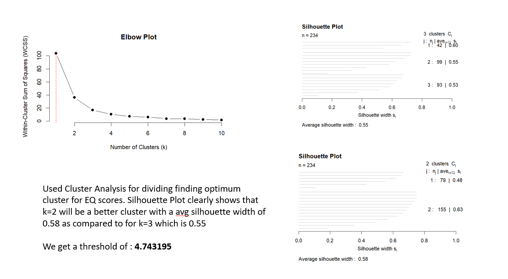
  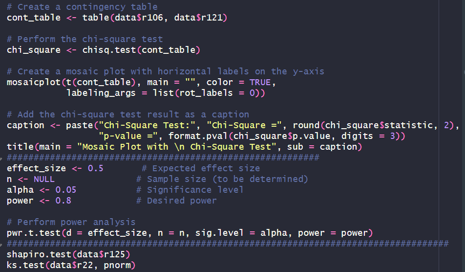
  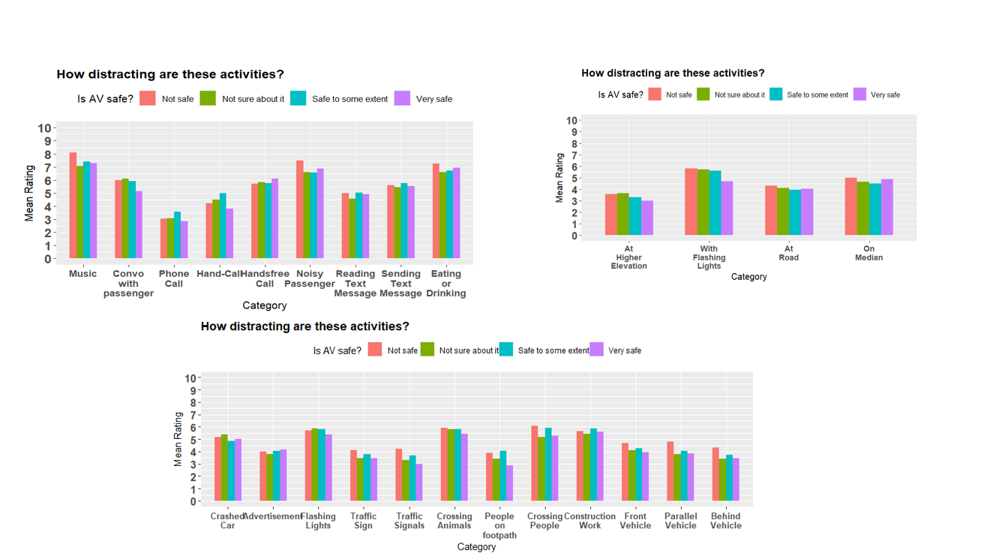
  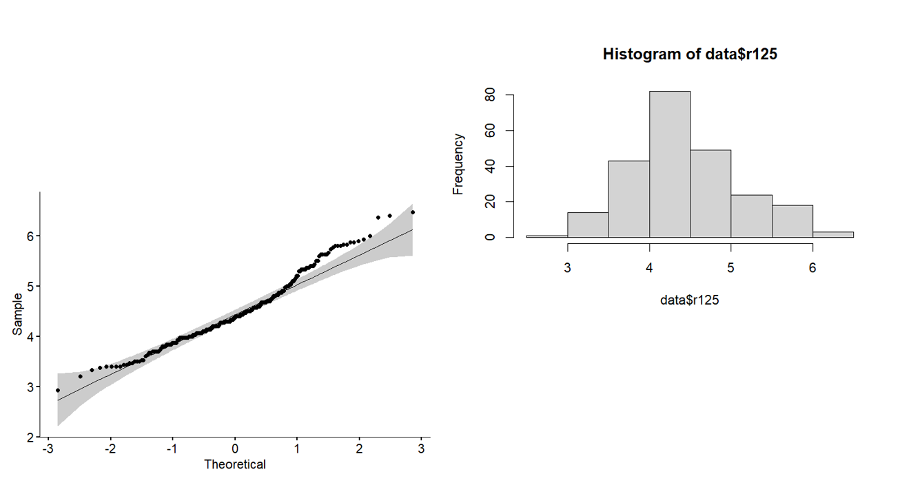

  </tr>
</table>

## Projects

### Time Evolution of Fluid Flows using DMD 

*📅 Duration:* Jan'23 - May'23

*🔧 Description:* 

*Methodology and Analysis:* Applied Dynamic Mode Decomposition (DMD) incorporating Koopman modes to analyze time-dependent fluid flow data. Computed Koopman operator eigenvalues (phi values) to reveal intrinsic temporal patterns in the flow dynamics.

*Algorithm Implementation:* Developed custom MATLAB scripts to implement DMD algorithms, integrating Koopman analysis.Utilized matrix decomposition techniques to extract Koopman modes and corresponding phi values.

*Insights and Applications:* Gained insights into the temporal behavior of fluid flows, revealing transient phenomena and recurring patterns.
Contributed to understanding turbulence dynamics, vortical structures, and interactions within the flow field.

<table>
  <tr>
    <td align="center">
      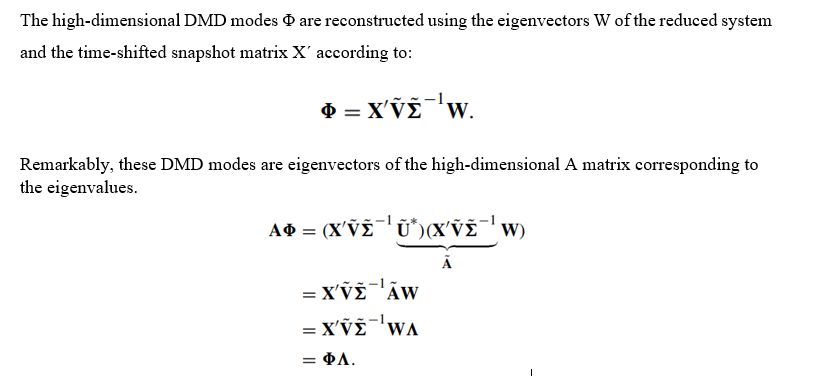
      
Fig. 1 Mathematical Equation

    </td>
    <td align="center">
      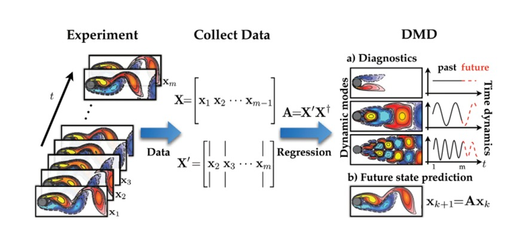
      
Fig. 2 Procedure

    </td>
    <td align="center">
      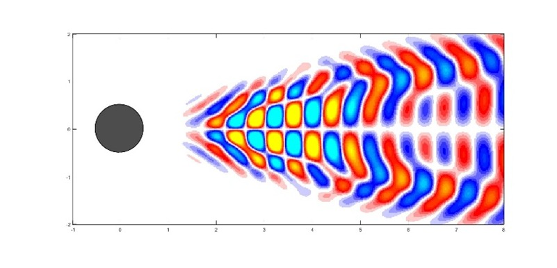
      
Fig. 3 Spatial Modes for r=9

    </td>
  </tr>
</table>
 

---

### Team Trident Formula Racing Aerodynamics Designs

*📅 Duration:*  Jan ’22- Present

*🔧 Description:*

- *Nosecone Refinement and Aero Efficiency:* Collaborated on optimizing the nosecone design to enhance aerodynamic performance. Employed SolidWorks and ANSYS for meticulous design and airflow analysis, achieving optimal drag reduction and increased downforce.

- *Ground Effect Augmentation - Innovative Underplates:* Led the innovation of underplates, integrating vortex generators and boundary layer control devices. Leveraged SolidWorks and ANSYS to enhance ground effect, significantly boosting vehicle stability and cornering prowess.

- *Simulation-Driven Design Expertise:* Showcased adeptness in simulation-driven design using SolidWorks and ANSYS. Translated theoretical concepts into high-performance reality by conducting structural and fluid flow analyses, guaranteeing optimal performance under race conditions.

This multifaceted experience exemplifies my proficiency in utilizing advanced tools for innovative aerodynamic solutions in the competitive realm of high-performance racing.

<table>
  <tr>
    <td align="center">
      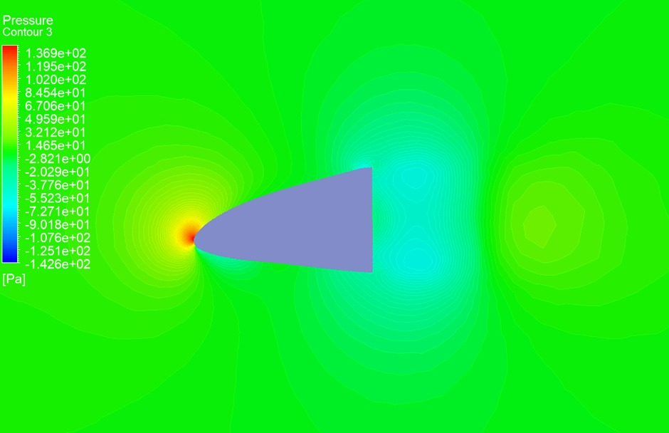
      
Fig. 1 Pressure contour for the final nose cone mode

    </td>
    <td align="center">
      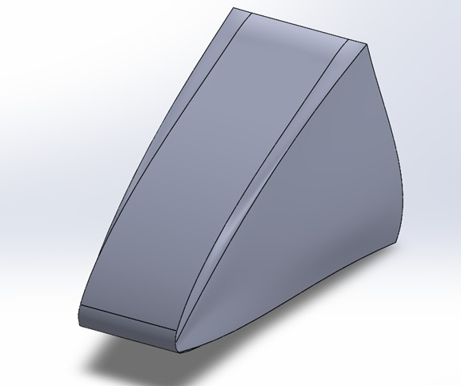
      
Fig. 2 Nosecone made on Solidworks

    </td>
  </tr>
  <tr>
    <td align="center">
     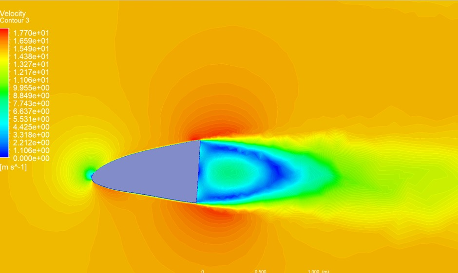
      
Fig. 3 Velocity contour for the final nose cone model

    </td>
    <td align="center">
      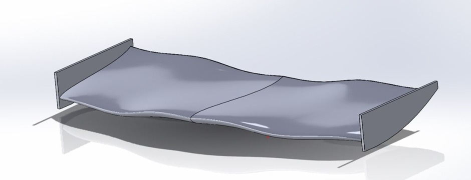
      
Fig. 4 Front Wing

    </td>
  </tr>

<!--## Skills

- 🔩 Mechanical Design and Analysis
- 🛠️ CAD/CAM and 3D Modeling
- 🔬 Materials Science and Engineering
- 🤖 Robotics and Automation
- 💻 Programming (C++, Python)

-->
